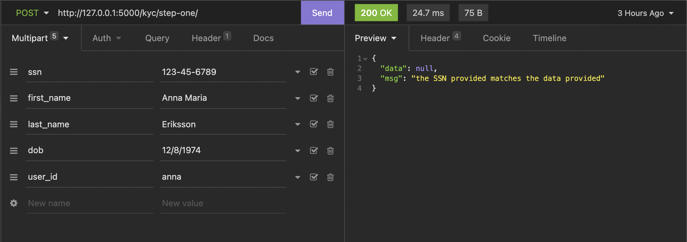
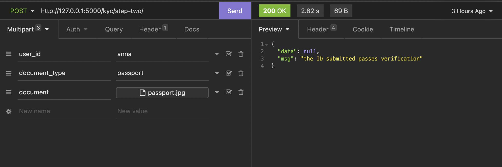
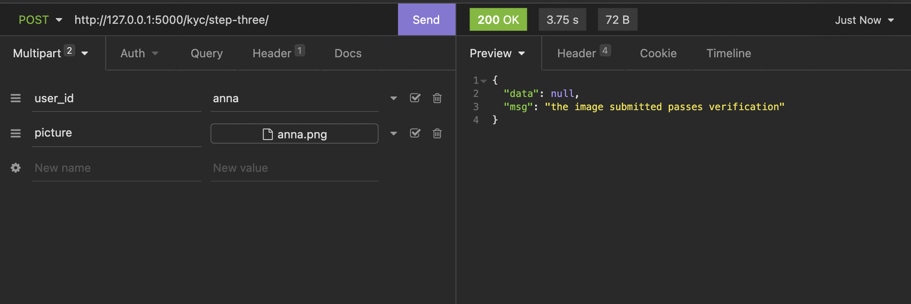

# Solofunds Hackathon Submission

This repo contains a three-level KYC API that works hand-in-hand to verify a user's identity eliminating every form of identity theft.

The verification process is split into three parts:
- SSN verification level: In this phase, the user submits their first name, last name, dob, SSN, and their details are initially verified with the provided SSN.
- Document verification level: In this phase, the user submits an identifying document (passport, ID card, or driver's license). Then using OCR technologies and machine learning, extract information from their documents such as names, dob, and image.
- Picture verification level: In this phase, the user submits an image of themselves. Then using machine learning and face matching algorithms, we validate that the submitted photo of themselves match the same image extracted from their identity document.


## API Reference

#### Complete KYC phase one

```http
POST /kyc/step-one/
```

| Parameter | Type     | Description                |
| :-------- | :------- | :------------------------- |
| `user_id` | `string` | **Required**. Your user identifier |
| `ssn` | `string` | **Required**. Your user SSN |
| `first_name` | `string` | **Required**. Your user first name |
| `last_name` | `string` | **Required**. Your user last name |
| `dob` | `string` | **Required**. Your user date of birth |

#### Complete KYC phase two

```http
POST /kyc/step-two/
```

| Parameter | Type     | Description                |
| :-------- | :------- | :------------------------- |
| `user_id` | `string` | **Required**. Your user identifier |
| `document_type` | `string` | **Required**. Your identifier document type |
| `document` | `file` | **Required**. Your identifier document |

#### Complete KYC phase three

```http
POST /kyc/step-three/
```

| Parameter | Type     | Description                |
| :-------- | :------- | :------------------------- |
| `user_id` | `string` | **Required**. Your user identifier |
| `picture` | `file` | **Required**. Your user personal image |


## Environment Variables

To run this project, you will need to add the following environment variables to your `.env` file

`DATABASE_URI`

`ACCURASCAN_OCR_KEY`

`ACCURASCAN_FACE_MATCH_KEY`


## Run Locally

Clone the project

```bash
git clone https://github.com/LordGhostX/solofunds-api
```

Go to the project directory

```bash
cd solofunds-api
```

Install dependencies

```bash
pip install -r requirements.txt
```

Start the server

```bash
python app.py
```


## Screenshots







> sample passport and picture can be found in the `images` directory.


## Authors

- [@LordGhostX](https://www.github.com/LordGhostX)
